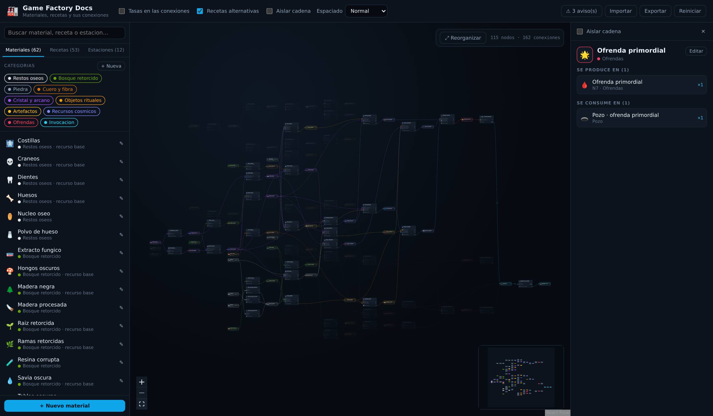

# Game Factory Docs

Visualizador de nodos, hecho con **React Flow**, para documentar el árbol de
producción de un juego de automatización: qué materiales existen, qué recetas
los transforman y cómo se conectan entre sí.

**▶ [Verlo en funcionamiento](https://polipg.github.io/game-factory-docs/)**



## Qué hace

- **Grafo bipartito**: los nodos azulados son **materiales** y los nodos con
  cabecera de máquina son **recetas**. Una arista `material → receta` es un
  ingrediente; una arista `receta → material` es un producto.
- **Layout automático** de izquierda a derecha con dagre: los recursos base
  quedan a la izquierda y los productos finales a la derecha. Los ciclos (por
  ejemplo reciclar residuo pesado en combustible) se resuelven solos.
- **Tasas calculadas**: cada arista y cada fila de una receta muestran las
  unidades por ciclo y las unidades por minuto (`cantidad × 60 / tiempo`).
- **Aislar cadena**: al seleccionar un nodo se resalta toda su cadena de
  producción, aguas arriba y aguas abajo; el interruptor "Aislar cadena" oculta
  todo lo demás.
- **Edición completa** desde la interfaz: materiales, recetas, máquinas y
  categorías. Los cambios se guardan en el navegador (`localStorage`).
- **Importar / exportar JSON** para versionar el árbol en el repositorio o
  compartirlo.
- **Avisos de consistencia**: materiales que ninguna receta produce, recetas sin
  salida, referencias rotas, ciclos de 0 s.

## Puesta en marcha

```bash
npm install
npm run dev      # http://localhost:5173
```

Otros comandos:

```bash
npm run build      # comprueba tipos y genera dist/
npm run preview    # sirve dist/ en local
npm run typecheck  # solo TypeScript
```

## Despliegue en GitHub Pages

`.github/workflows/deploy.yml` compila el proyecto y publica `dist/` en Pages.

- **Se compila en cada push y en cada pull request**, en cualquier rama, así un
  error de tipos o de build salta antes de mezclar.
- **Se publica solo desde la rama por defecto** del repositorio. La condición es
  dinámica (`github.ref_name == github.event.repository.default_branch`), de
  modo que si la rama por defecto se renombra o pasa a ser `main`, el
  despliegue la sigue sin tocar el workflow.
- El propio workflow activa Pages con origen *GitHub Actions* la primera vez
  (`configure-pages` con `enablement: true`). Si tu organización no lo permite,
  actívalo a mano en **Settings → Pages → Source: GitHub Actions** y vuelve a
  lanzar el workflow.
- También se puede lanzar a mano desde **Actions → Deploy a GitHub Pages → Run
  workflow**.

El sitio es estático y sin backend: los datos viven en `src/data/seed.ts` y las
ediciones de cada visitante se guardan en su propio navegador. `vite.config.ts`
usa `base: './'` (rutas relativas), así que funciona igual en la raíz del
dominio que en un subdirectorio como `/game-factory-docs/`.

## Modelo de datos

Todo el árbol es un único objeto JSON (`src/data/seed.ts` trae uno de ejemplo)
con cuatro listas. Definido en `src/types.ts`:

```ts
interface Category { id: string; name: string; color: string }

interface Machine {
  id: string;
  name: string;
  icon: string;
  powerMw?: number;   // negativo = genera energía
}

interface Material {
  id: string;
  name: string;
  icon: string;         // emoji
  categoryId: string;
  raw?: boolean;        // se extrae del mundo, no se fabrica
  extractedBy?: string; // id de máquina
  extractionRate?: number;
  description?: string;
}

interface Recipe {
  id: string;
  name: string;
  machineId: string;
  time: number;                                  // segundos por ciclo
  inputs: { materialId: string; amount: number }[];
  outputs: { materialId: string; amount: number }[];
  alternate?: boolean;                           // receta alternativa
  notes?: string;
}
```

Una receta puede tener **varias salidas** (subproductos, como el residuo pesado
de la refinería) y **ninguna entrada** (una fuente). Los materiales marcados
como `raw` se dibujan con la etiqueta "recurso base" y no generan aviso por no
tener receta que los produzca.

### Cargar tus propios datos

Dos opciones:

1. **Desde la interfaz**: botón *Importar* y elige un JSON con la forma de
   arriba. *Exportar* descarga el estado actual. El importador valida la
   estructura y explica qué campo falla.
2. **En el código**: sustituye el contenido de `src/data/seed.ts`. Es el estado
   inicial y el que restaura el botón *Reiniciar*.

## Estructura del proyecto

```
src/
  types.ts                 modelo de datos
  data/seed.ts             árbol de producción de ejemplo
  store/factoryStore.ts    estado global (zustand) + persistencia
  lib/
    graph.ts               datos → nodos y aristas; trazado de cadenas
    layout.ts              colocación automática con dagre
    io.ts                  importar/exportar JSON y avisos de consistencia
    util.ts                slugs, formato de cantidades, tasas por minuto
  components/
    FactoryGraph.tsx       lienzo de React Flow
    nodes/MaterialNode.tsx nodo de material
    nodes/RecipeNode.tsx   nodo de receta (un conector por ingrediente)
    Sidebar.tsx            buscador, filtros por categoría y listados
    Inspector.tsx          detalle del elemento seleccionado
    Toolbar.tsx            interruptores de vista, importar/exportar, avisos
    *Form.tsx              formularios de edición
```

## Atajos de uso

| Acción | Cómo |
| --- | --- |
| Ver detalles | Clic en un nodo o en una fila del panel izquierdo |
| Centrar un elemento | Clic en su fila del panel izquierdo |
| Mostrar/ocultar una categoría | Clic en su etiqueta de color |
| Editar una categoría | Doble clic en su etiqueta de color |
| Editar material o receta | Botón ✎ en su fila, o *Editar* en el panel derecho |
| Recolocar el grafo | Botón *Reorganizar* (recupera el layout tras mover nodos) |
| Cerrar un formulario | `Esc` |

## Stack

React 19 · TypeScript · Vite · [@xyflow/react](https://reactflow.dev) 12 ·
dagre · zustand.
